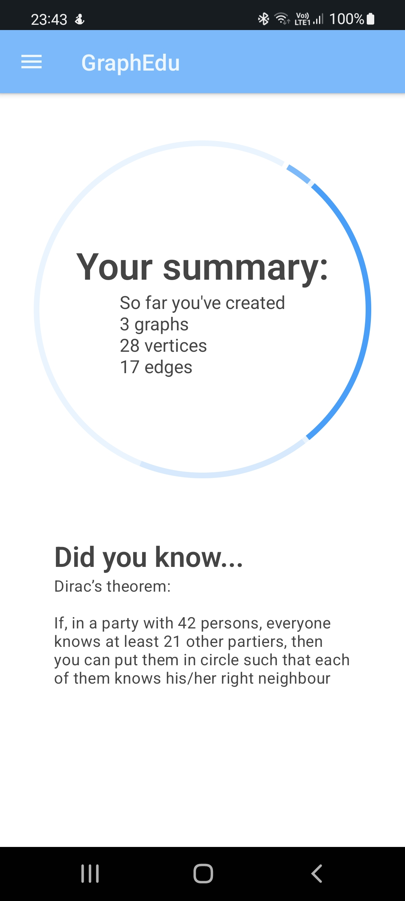
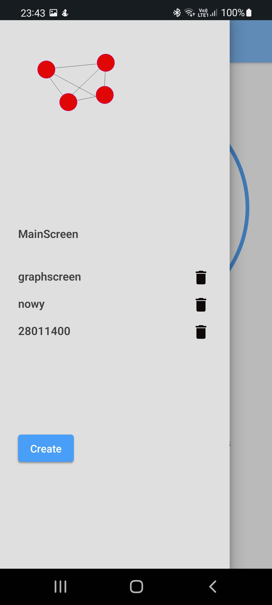
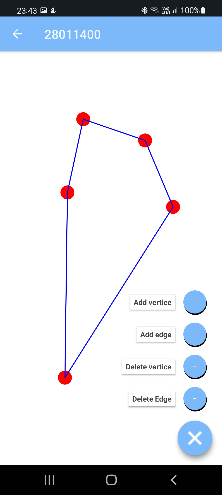
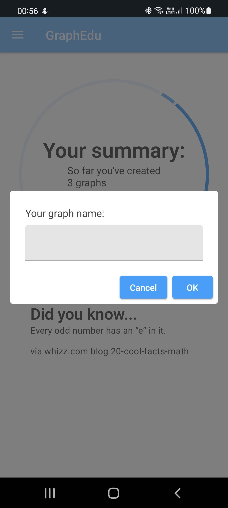
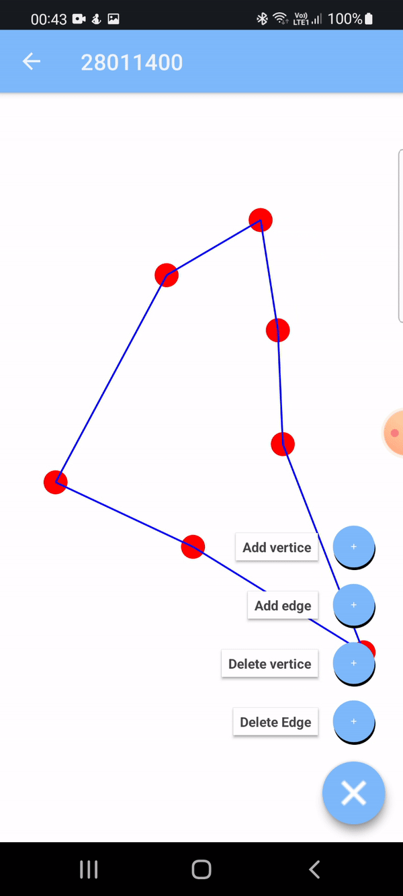
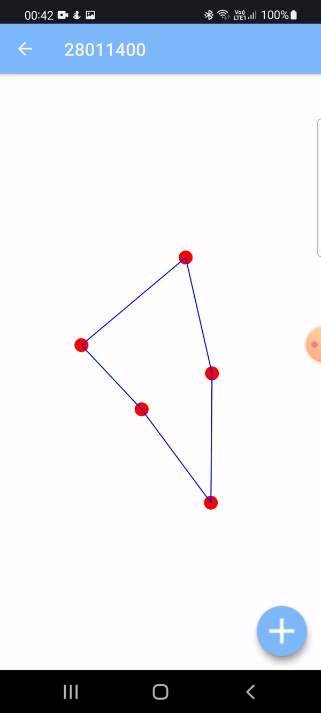

# GRAPHEDU
Discover new learning possibilities with a new App that allows you to create and edit graphs!

## Table of contents
1. [How to run](#run)
2. [App description](#description)
3. [Development plan](#plan)

## How to run

There are two option to start this application:
1. With downloaded release via github -> see releases page on right side of the screen
2. Download via Google Play (pending)

## App description

GraphEdu is an App created for educational purpose. It allows kids, youth and adults to play with marvelous world of Discrete Mathematics. It can be used either to learn new things or in more advanced use cases such as examining cognitive functions.

Take a look at some of our features:
### Main Screen

  

### Graph Screen

  

### Drawer Menu

  

### Adding graph

  

## How app would look like if I had unlimited time...

Current app version presents kind of basic functionalities. In the future I'd like to develop it and make something bigger out of it. One of the first functionalities I'd like to have is a remote db that would store users. Integration of this app with some outside data source would not be that hard so it's the first main target to achieve.  
Another nice to have feature is mobile and dev version. Since app is written in Kotlin it's not that hard to extract the business logic and implement it in some Native Android App. With other target platforms it's a hard one with my tech stack but we'll get there someday.  
This app has got potential to manage all finances of users not only typing them down by hand and see results. One of a long distance goal is to develop payment system so users could use our app instead of their banks' apps.
Application for sure could do with better UI, hope we'll get there too :)
